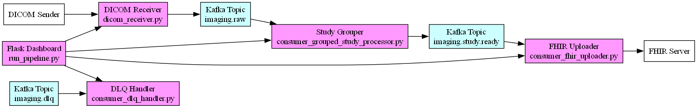

## Project Overview: DICOM to FHIR Pipeline with Kafka 
This system ingests DICOM files, extracts metadata, groups them into studies, and converts them into FHIR ImagingStudy bundles to send to a FHIR server. 
It uses Kafka to orchestrate decoupled stages and ensures resilience with retry + dead-letter queue logic.

### Architecture Overview   

                              +------------------------+
                              |  batch_send_by_study.py|
                              +-----------+------------+
                                          |
                                          v
                               +----------v-----------+
                               |   dicom_receiver.py   |
                               +----------+-----------+
                                          |
                                          v
                       +------------------v------------------+
                       | consumer_grouped_study_processor.py |
                       +-----------+--------------+----------+
                                   |              |
                  +----------------v--+       +---v----------------+
                  | consumer_fhir_uploader.py  | consumer_dlq_handler.py
                  +------------------+         +------------------+
                             |                          |
                             v                          v
                 +-----------v-----------+    +---------v--------+
                 |     FHIR Server       |    |   DLQ (Kafka)    |
                 |    (e.g., HAPI)       |    +------------------+
                 +-----------------------+

                    ▲         ▲         ▲         ▲
                    |         |         |         |
        +-----------+---------+---------+---------+-------------+
        |             run_pipeline.py (Flask Dashboard)         |
        |  - Monitors services                                   |
        |  - Provides /status, logs, stop/start controls         |
        +--------------------------------------------------------+

## How to use it:
1. docker compose up -d   
     - to start in docker the kafka broker
2. pip install -r requirements.txt 
3. python run_pipeline.py
     - to start the services, also the end point http://localhost:5000
4. python batch_send_by_study
     - to start the dicom send process

### Full Workflow
0. #### batch_send_by_study.py
   - parse a given folder and group the dicom files by studyuid call foreach file the dicom_sender
2. #### dicom_sender.py
     - Reads .dcm files from a folder.
     - Sends them via DICOM C-STORE to a receiver (dicom_receiver).
     - Supports multiple patients, studies, series, subfolders.
3. #### dicom_receiver.py
     - Listens for incoming DICOM files (acts as a DICOM SCP).
     - Saves received files to ./received_dicoms/Studies.
     - Extracts metadata:
     - PatientName,PatientID,PatientSex,PatientBirthDate, AccessionNumber, StudyInstanceUID, SeriesInstanceUID, SOPInstanceUID
     - Publishes metadata to Kafka topic: imaging.raw

3. #### consumer_grouped_study_processor.py
     - Listens on imaging.raw
     - Groups incoming files by StudyInstanceUID into study batches using a TTL cache
     - Once a study is considered "complete" (10 seconds inactivity), emits:
     - study_uid, patient_id, accession_number, modality, series, instances, and patient info
     - Sends to Kafka topic: imaging.study.ready

 4. #### consumer_fhir_uploader.py
     - Listens on imaging.study.ready
     - Builds a FHIR transaction bundle with:
     - A Patient resource (from DICOM info: name, sex, accession number)
     - An ImagingStudy resource (with series + instances)
     - Sends the bundle to the FHIR server (http://localhost:8080/fhir)
     - Also saves a local copy under ./bundles/
     - Retry logic: retries failed FHIR sends up to 3 times

  5. #### consumer_dlq_handler.py
     - Reads from Kafka topic: imaging.failed

### Message flow summary

| Step | Source                                | Target              | Kafka Topic           | Description                              |
| ---- | ------------------------------------- | ------------------- | --------------------- | ---------------------------------------- |
| 1    | `dicom_sender.py`                     | `dicom_receiver.py` | —                     | Sends DICOM via C-STORE                  |
| 2    | `dicom_receiver.py`                   | Kafka Broker        | `imaging.raw`         | Emits metadata message per DICOM file    |
| 3    | `consumer_grouped_study_processor.py` | Kafka Broker        | `imaging.study.ready` | Groups by study and emits study-level    |
| 4    | `consumer_fhir_uploader.py`           | FHIR Server         | —                     | Creates + sends FHIR ImagingStudy bundle |

### Tech Stack
| Component      | Library/Tool                   |
| -------------- | ------------------------------ |
| DICOM I/O      | `pydicom`, `pynetdicom`        |
| Messaging      | `Kafka`, `kafka-python`        |
| Metadata cache | `cachetools.TTLCache`          |
| FHIR Bundle    | JSON, `requests`               |
| Resilience     | Retry logic, DLQ, TTL grouping |

